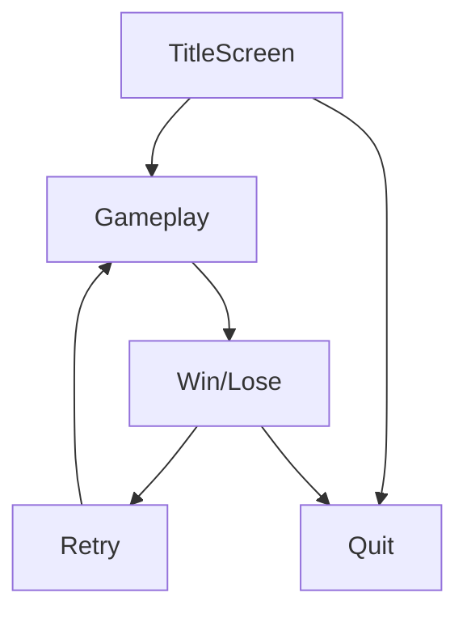

# Scene and Menu Structure
What happens from the moment the game loads to when the player wins, dies, or quits? This section is about designing how scenes connect and how the game feels to navigate.

## Core scenes a typical jam game should have
* Title screen
* Gameplay
* Game over / win screen
* Quit or restart option

{: .note }
> This page shows a minimal example. You can always add scenes, such as *instructions*, *options*, or *credits*.

## Game Flow
Your game flow should look somewhat like this:

In terms of code, the transition between scenes is typically handled by a [Game Manager](coding/game-manager.md).